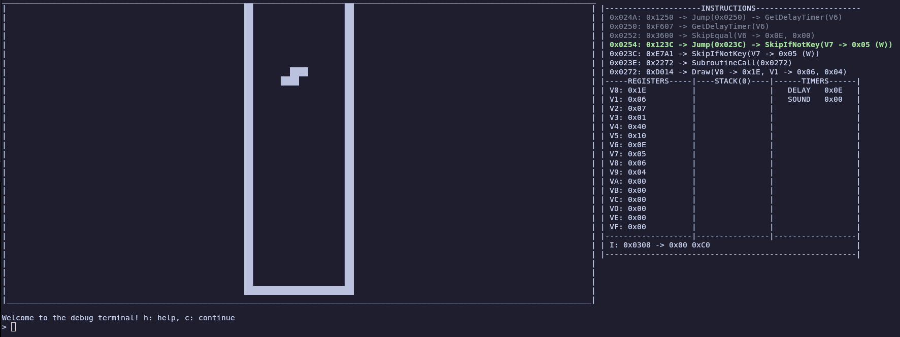

A collection of tools for the Chip-8 platform, written in Rust.

These were written primarily as a learning experience.

Tested on Linux Mint 22.1 Cinnamon, with the Kitty terminal.

# Tools
## c8rs
An emulator and debugger.

Running: `cargo run --bin c8rs /path/to/rom.ch8`

Controls:  
1234  
qwer  
asdf  
zxcv

Opening the debugger: Esc

## c8asm
An assembler.

The spec for the assembly can be found in c8asm/spec.md.

Running: `cargo run --bin c8asm /path/to/asm /path/to/output.ch8`

## c8disass
A disassembler.

The spec for the assembly can be found in c8asm/spec.md.

Running: `cargo run --bin c8disass /path/to/rom/ch8 > file.asm`

## c8cc
An *experimental* compiler.

This is a *WORK IN PROGRESS* and is VERY unfinished.

Running: `cargo run --bin c8cc /path/to/file`
